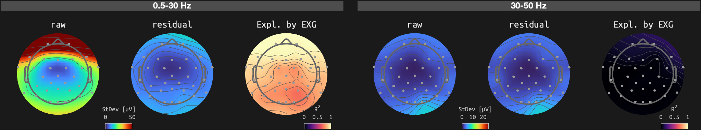
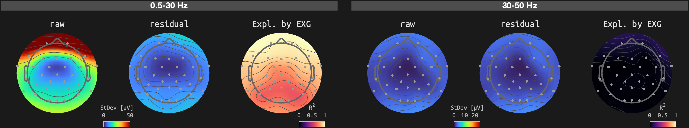
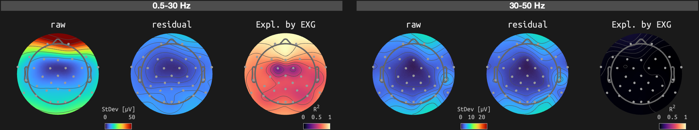

# sub-09
## sub-09_ses-01
### sub-09_ses-01_run-01

### sub-09_ses-01_run-02

### sub-09_ses-01_run-03

### sub-09_ses-01_run-04

### sub-09_ses-01_run-05

### sub-09_ses-01_run-06

### sub-09_ses-01_run-07

### sub-09_ses-01_run-08

### sub-09_ses-01_run-09

### sub-09_ses-01_run-10

### sub-09_ses-01_run-11

### sub-09_ses-01_run-12

### sub-09_ses-01_run-13

## sub-09_ses-02
### sub-09_ses-02_run-01

### sub-09_ses-02_run-02

### sub-09_ses-02_run-03

### sub-09_ses-02_run-04

### sub-09_ses-02_run-05

### sub-09_ses-02_run-07

### sub-09_ses-02_run-08

