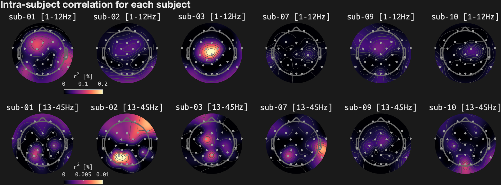

# Reliability check using Bohemian Rhapsody
Updated: 02-Feb-2026 20:02:36
## Inter-run correlation in overall ratings and liking timeseries

## Intra-/inter-subject correlation in EEG

## Intra-subject correlation for each subject

## Inter-run correlation in EEG (1-15 Hz)

## Inter-run correlation in EEG (20-45 Hz)

