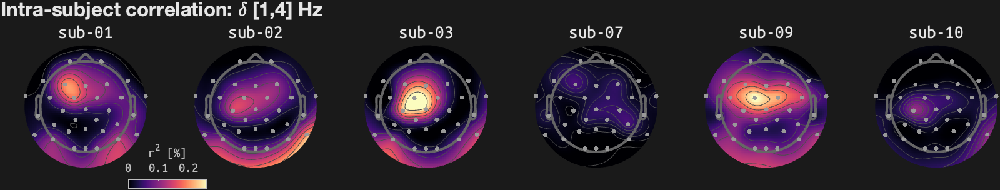
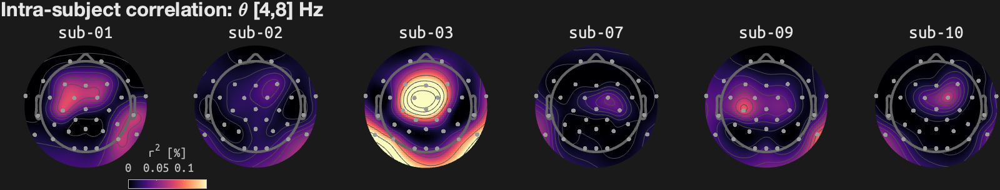
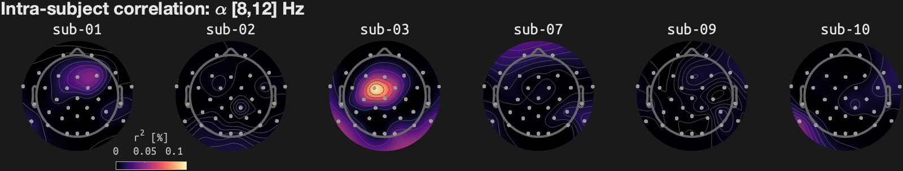
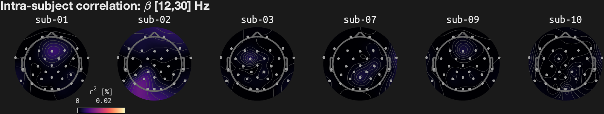
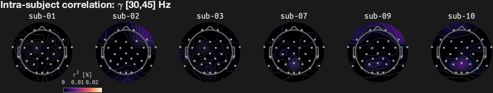

# Reliability check using Bohemian Rhapsody
Updated: 02-Feb-2026 21:29:01
## Inter-run correlation in overall ratings and liking timeseries

## Intra-/inter-subject correlation in EEG

## Inter-run correlation in EEG (1-12 Hz)

## Inter-run correlation in EEG (13-45 Hz)

## Intra-subject correlation for each subject
### delta-band [1-4] Hz

### theta-band [4-8] Hz

### alpha-band [8-12] Hz

### beta-band [12-30] Hz

### gamma-band [30-45] Hz

