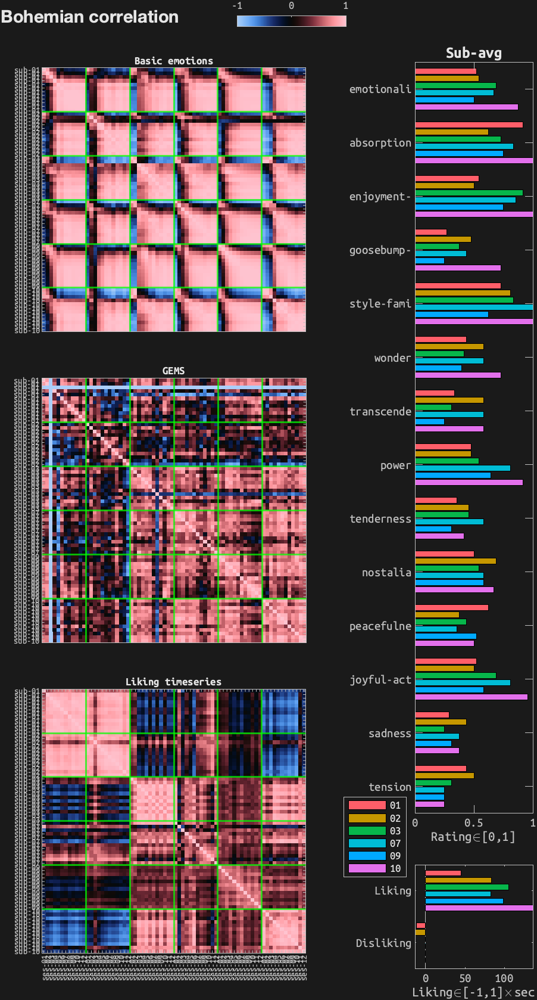
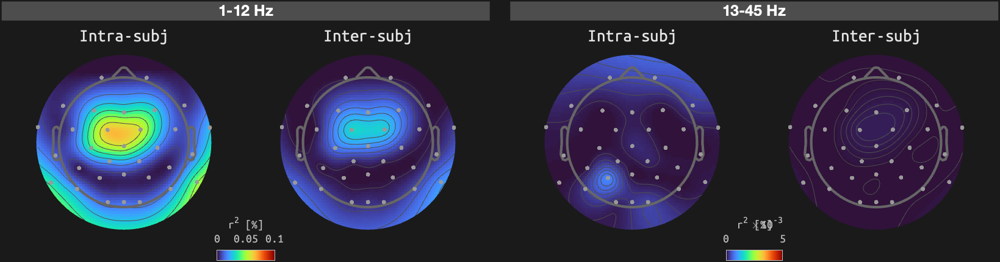
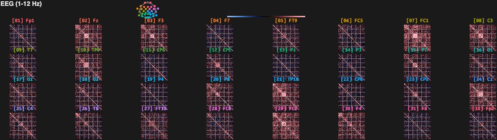
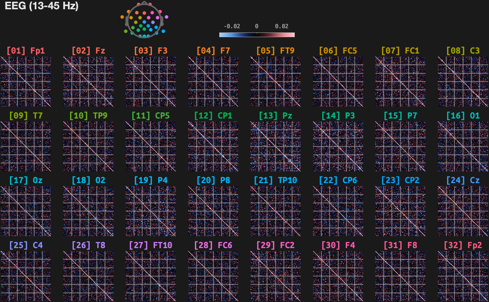

# Reliability check using Bohemian Rhapsody
Updated: 24-Jan-2026 21:35:39
## Inter-run correlation in overall ratings and liking timeseries

## Intra-/inter-subject correlation in EEG

## Inter-run correlation in EEG (1-10 Hz)

## Inter-run correlation in EEG (20-50 Hz)

