# sub-01
## sub-01_ses-01
### sub-01_ses-01_run-01
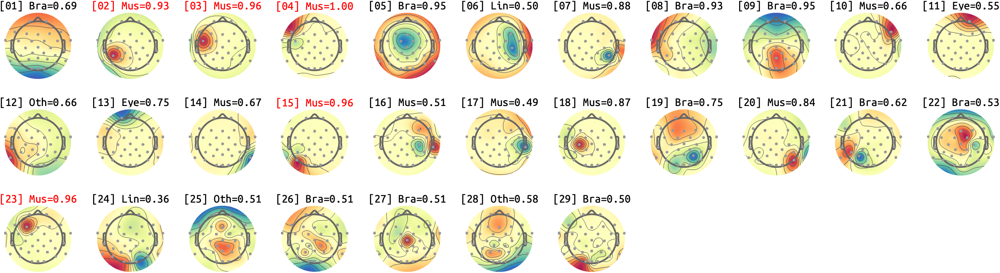

### sub-01_ses-01_run-02
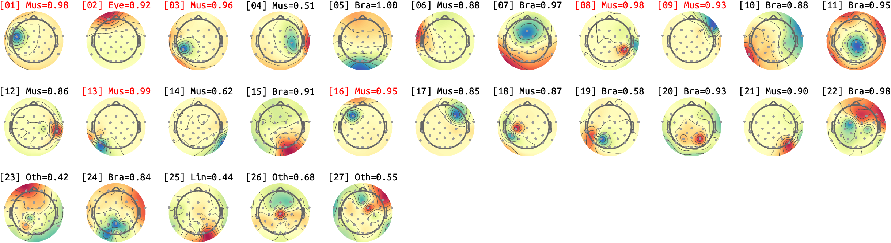

### sub-01_ses-01_run-03
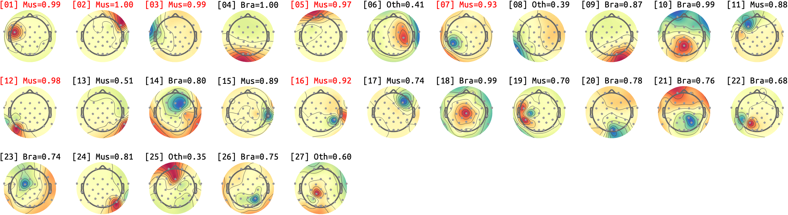

### sub-01_ses-01_run-04
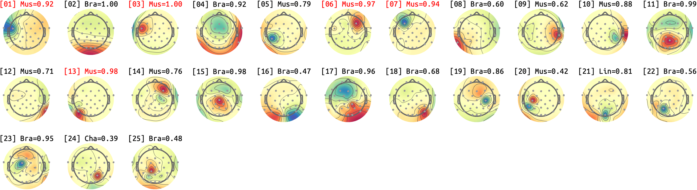

### sub-01_ses-01_run-05

### sub-01_ses-01_run-06
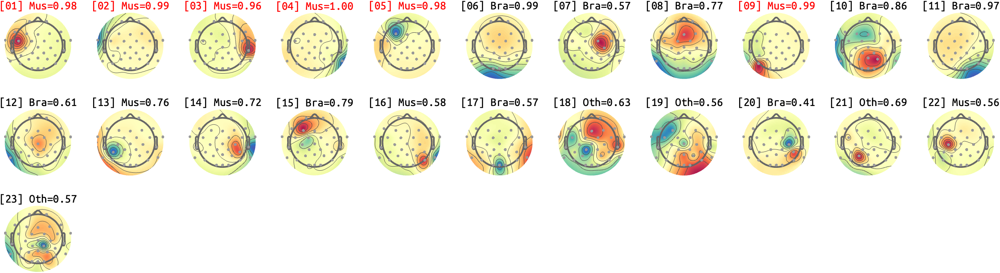

### sub-01_ses-01_run-07
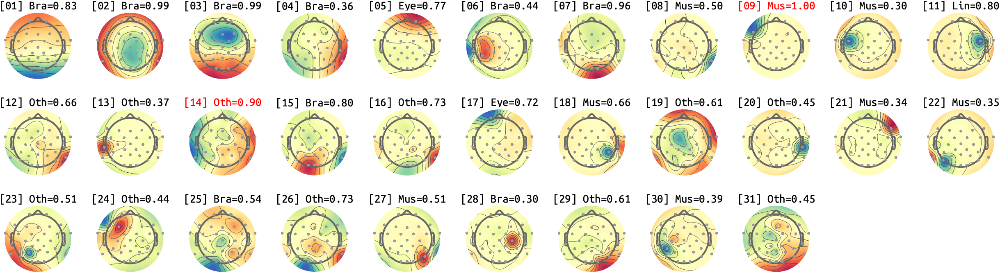

### sub-01_ses-01_run-08
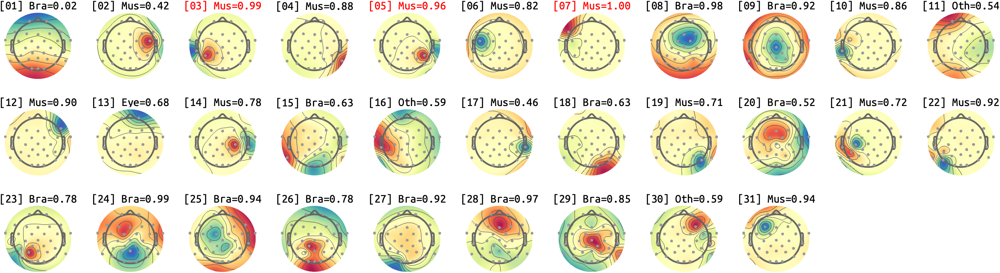

### sub-01_ses-01_run-09
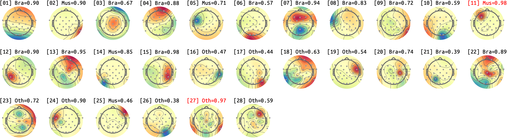

### sub-01_ses-01_run-10
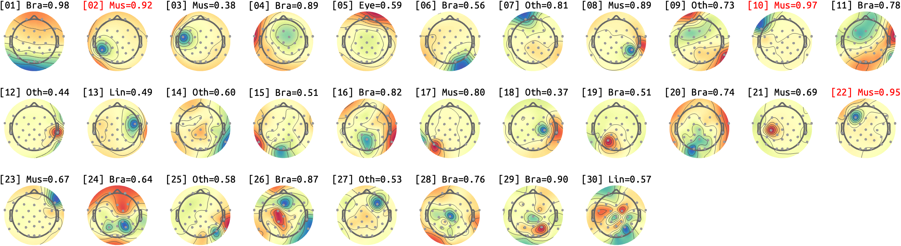

### sub-01_ses-01_run-11
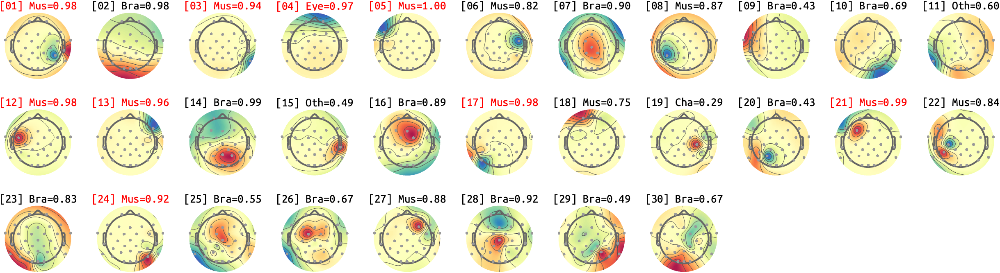

### sub-01_ses-01_run-12
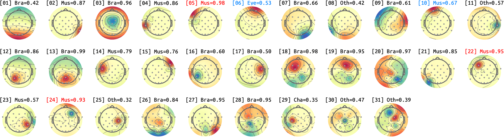

## sub-01_ses-02
### sub-01_ses-02_run-01
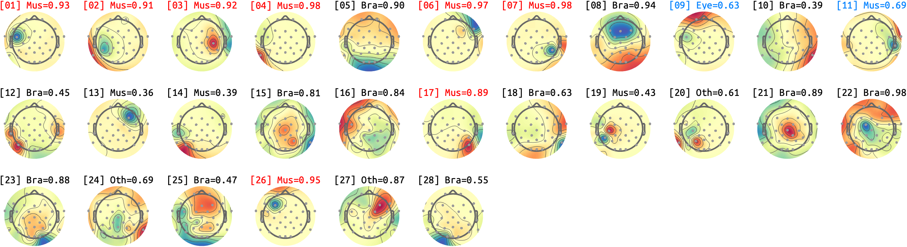

### sub-01_ses-02_run-02
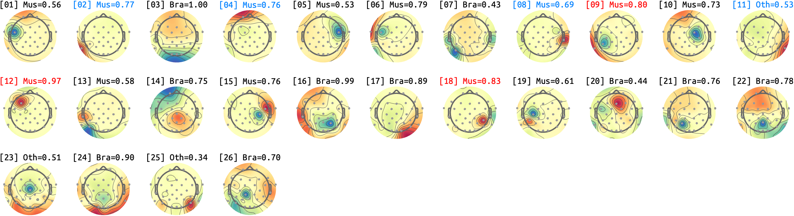

### sub-01_ses-02_run-03
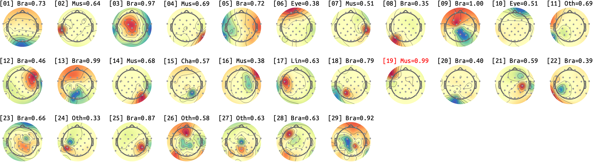

### sub-01_ses-02_run-04
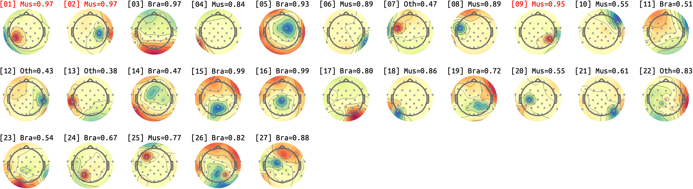

### sub-01_ses-02_run-05
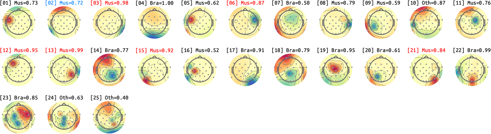

### sub-01_ses-02_run-06
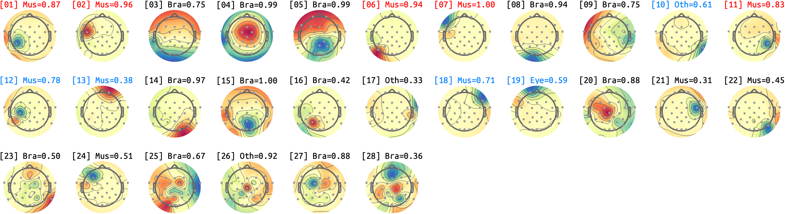

### sub-01_ses-02_run-07
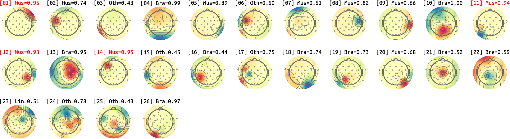

### sub-01_ses-02_run-08
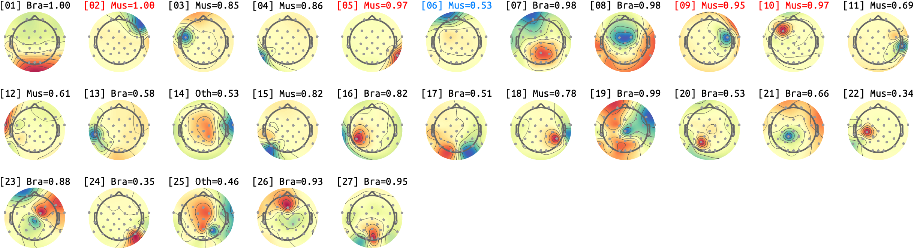

### sub-01_ses-02_run-09
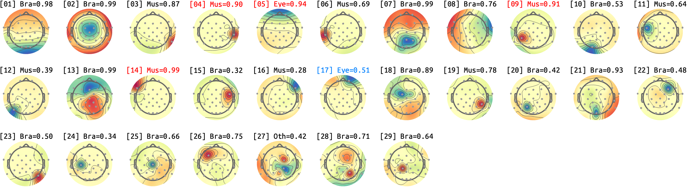

