# sub-01_ses-16
## sub-01_ses-16_run-01
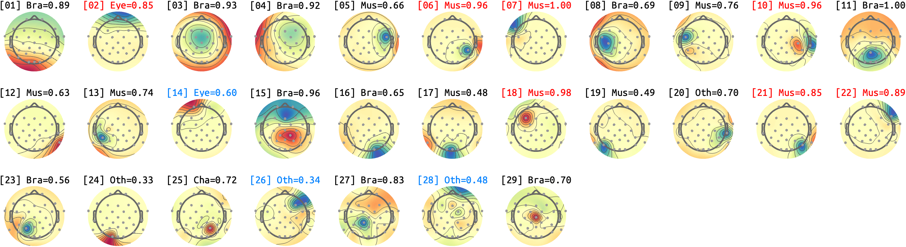

## sub-01_ses-16_run-02
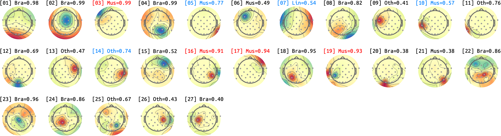

## sub-01_ses-16_run-03
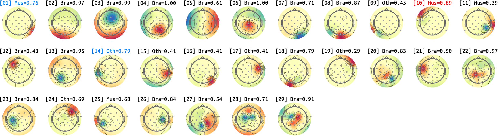

## sub-01_ses-16_run-04
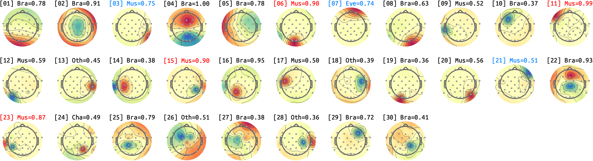

## sub-01_ses-16_run-05
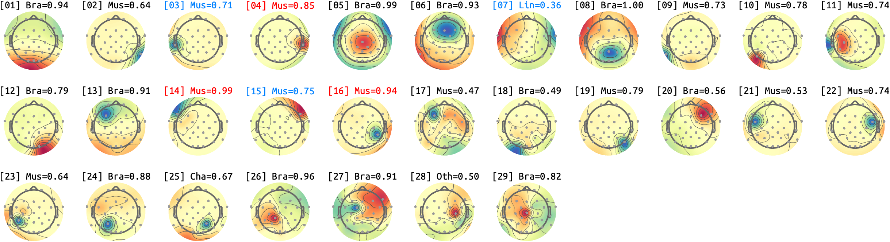

## sub-01_ses-16_run-06
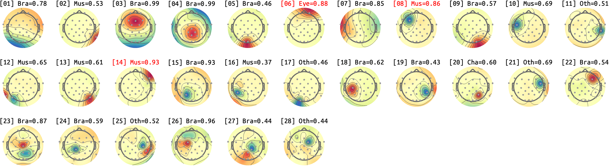

## sub-01_ses-16_run-07
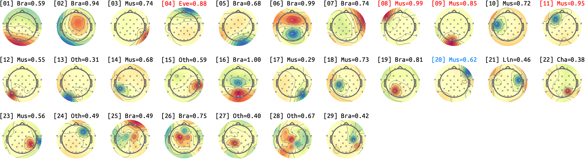

## sub-01_ses-16_run-08
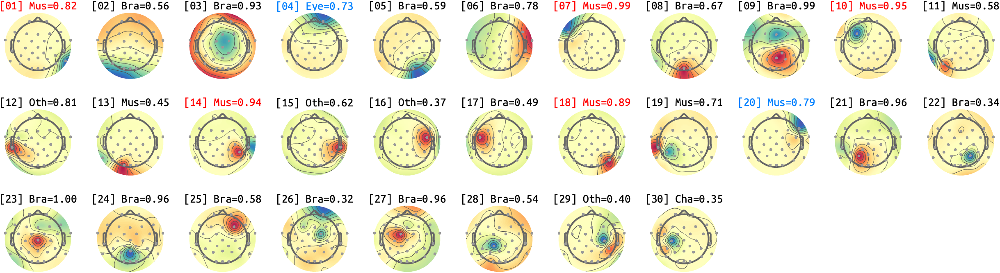

## sub-01_ses-16_run-09
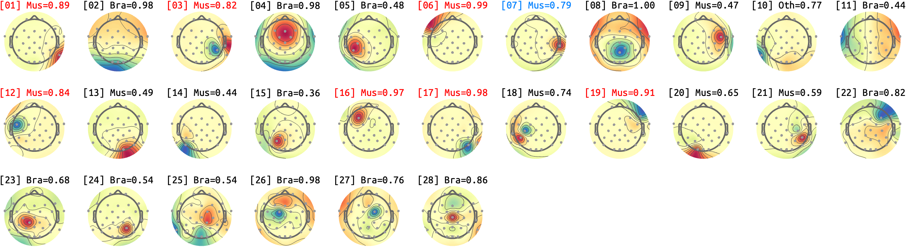

## sub-01_ses-16_run-10
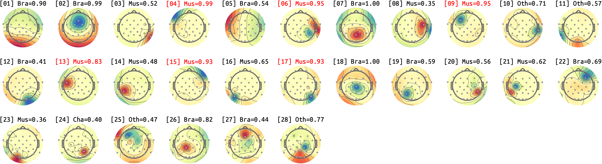

## sub-01_ses-16_run-11
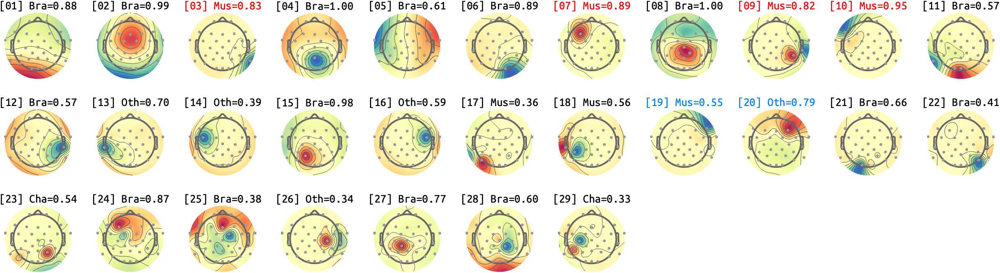

<small>Max IC-Label classificiation probability (except for HEART) for each IC. *Bra*: Brain, *Mus*: Muscle, *Lin*: Line, *Cha*: Channel, *Oth*: Other. *RED*: P>.90, *BLUE*: Manual-BAD, *GREEN*: Manual-GOOD</small>
