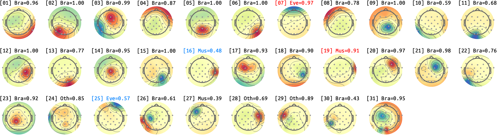
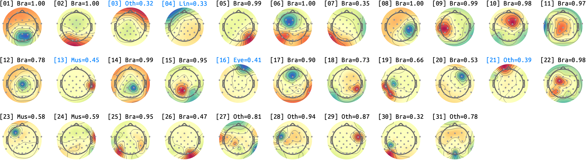
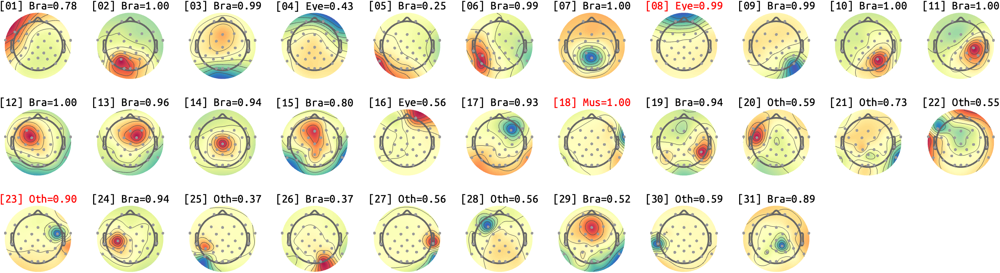
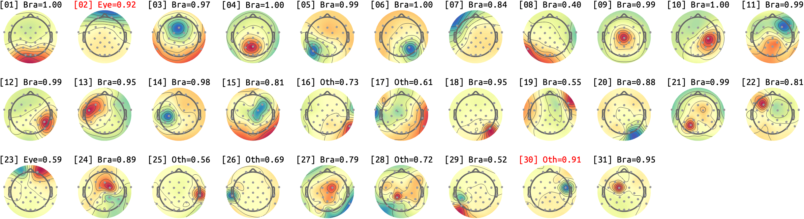
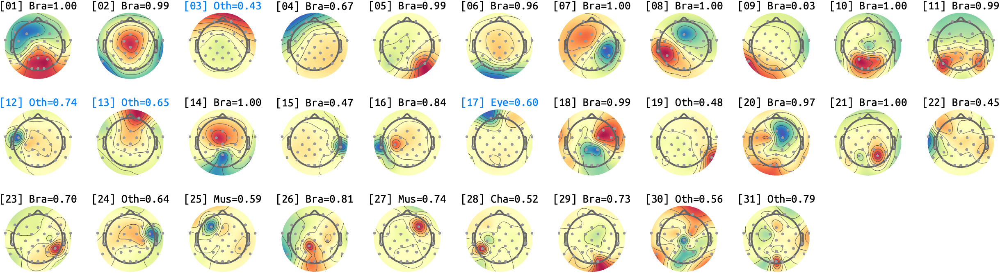
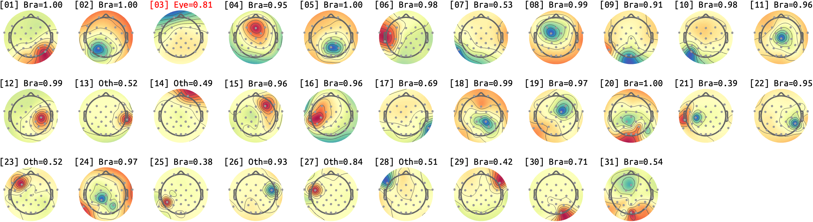
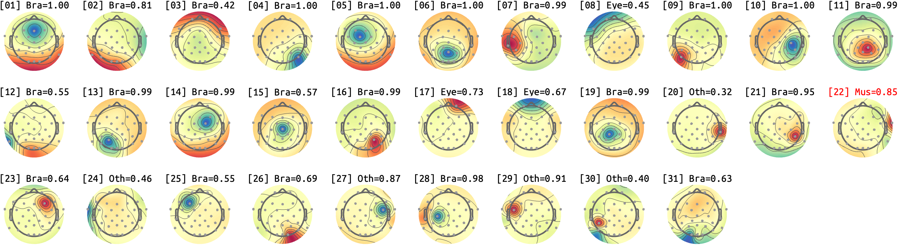
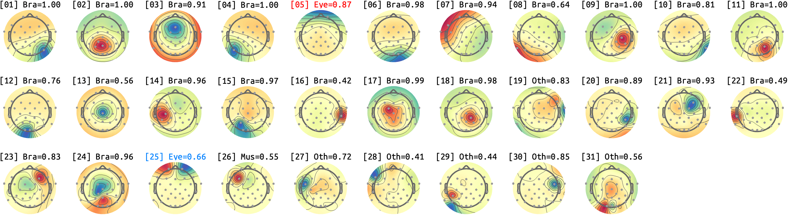

# sub-10_ses-03
## sub-10_ses-03_run-01

## sub-10_ses-03_run-02

## sub-10_ses-03_run-03

## sub-10_ses-03_run-04

## sub-10_ses-03_run-05

## sub-10_ses-03_run-07

## sub-10_ses-03_run-08

## sub-10_ses-03_run-09

<small>Max IC-Label classificiation probability (except for HEART) for each IC. *Bra*: Brain, *Mus*: Muscle, *Lin*: Line, *Cha*: Channel, *Oth*: Other. *RED*: P>.90, *BLUE*: Manual-BAD, *GREEN*: Manual-GOOD</small>
