# Overall ratings after listening
## emotionality
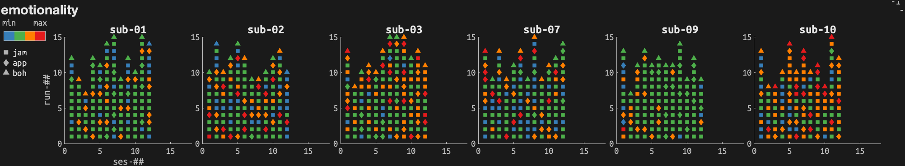

## absorption
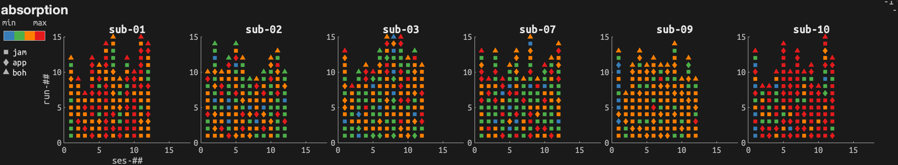

## enjoyment-liking
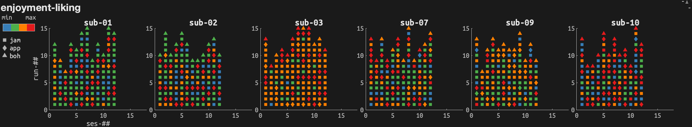

## goosebump-tears
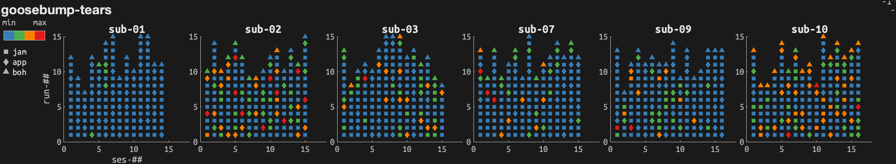

## style-familiarity
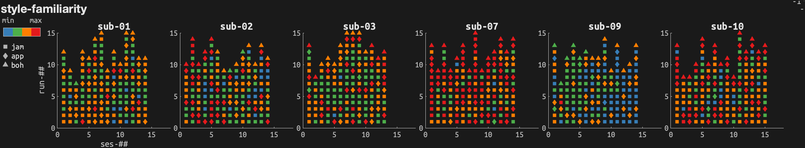

## wonder
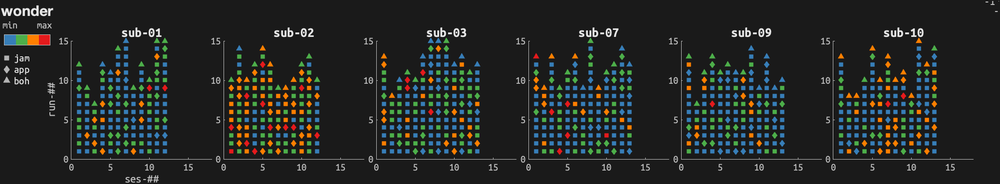

## transcendence
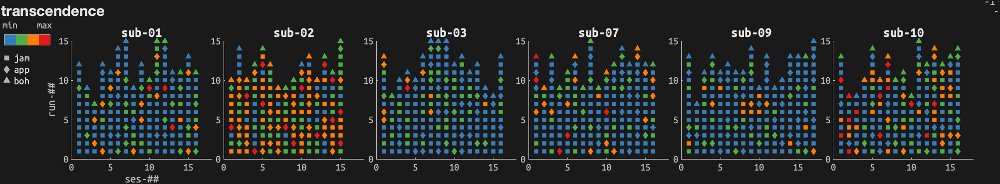

## power
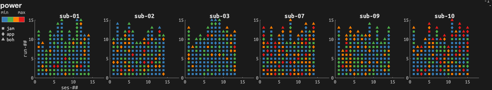

## tenderness
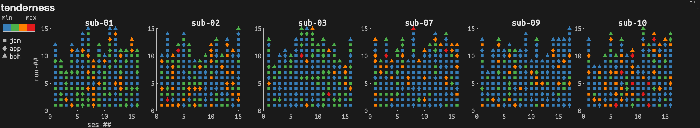

## nostalia
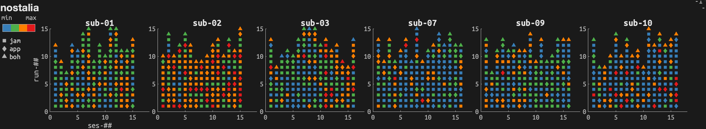

## peacefulness
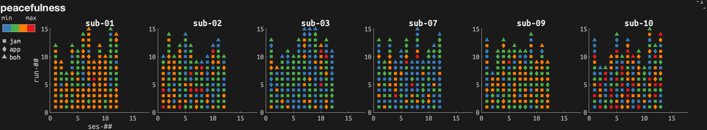

## joyful-activation
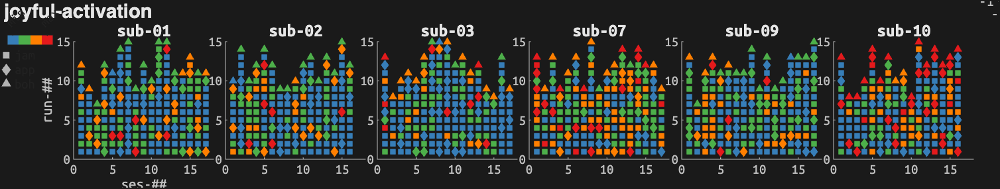

## sadness
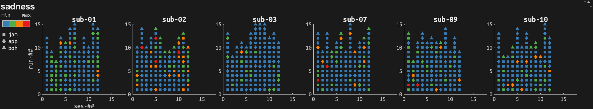

## tension
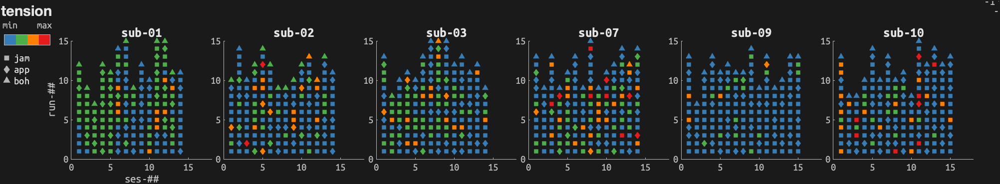

