# sub-01_ses-03
## sub-01_ses-03_run-rest-eyes-open
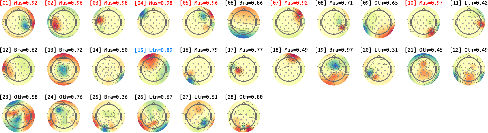

## sub-01_ses-03_run-rest-eyes-closed
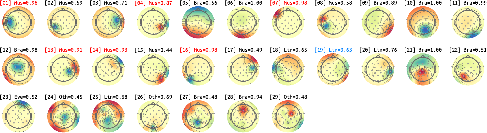

# sub-02_ses-03
## sub-02_ses-03_run-rest-eyes-open
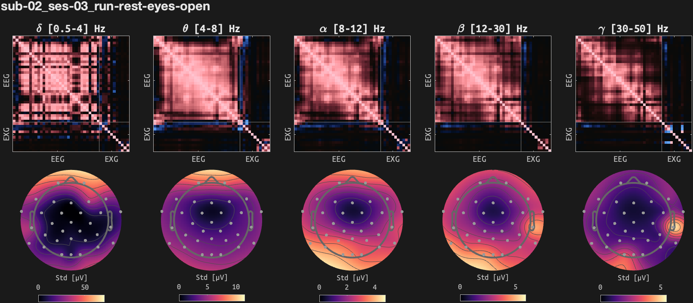

## sub-02_ses-03_run-rest-eyes-closed
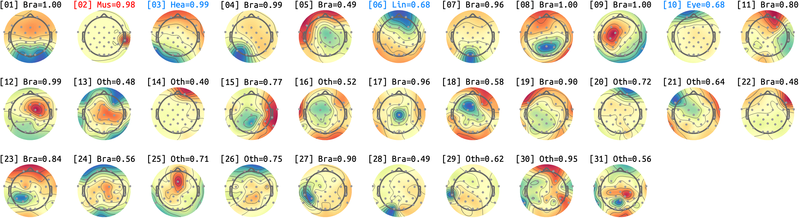

# sub-03_ses-03
## sub-03_ses-03_run-rest-eyes-open
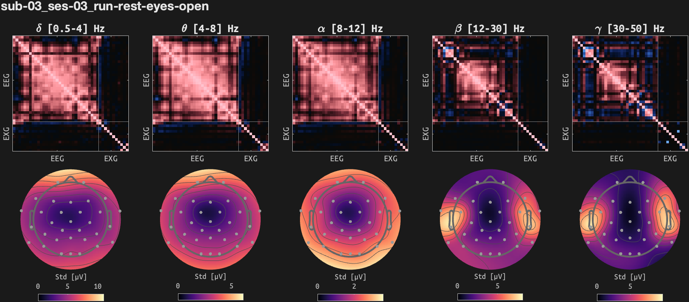

## sub-03_ses-03_run-rest-eyes-closed
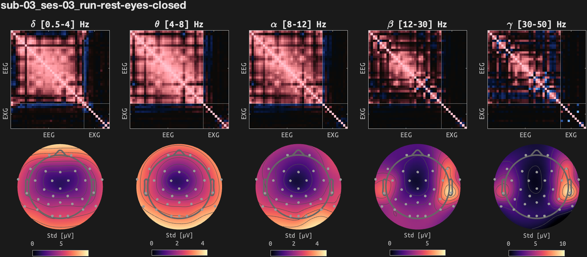

# sub-07_ses-03
## sub-07_ses-03_run-rest-eyes-open
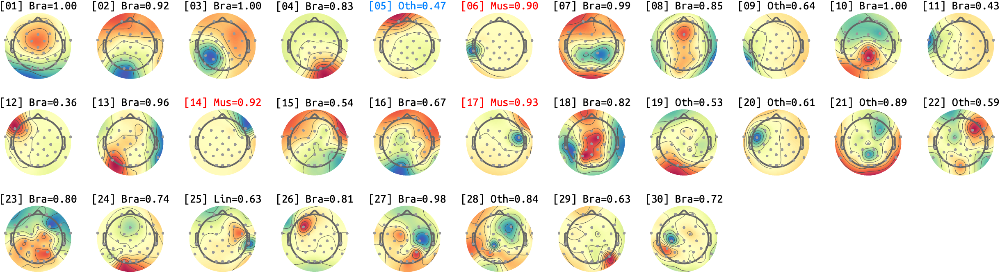

## sub-07_ses-03_run-rest-eyes-closed
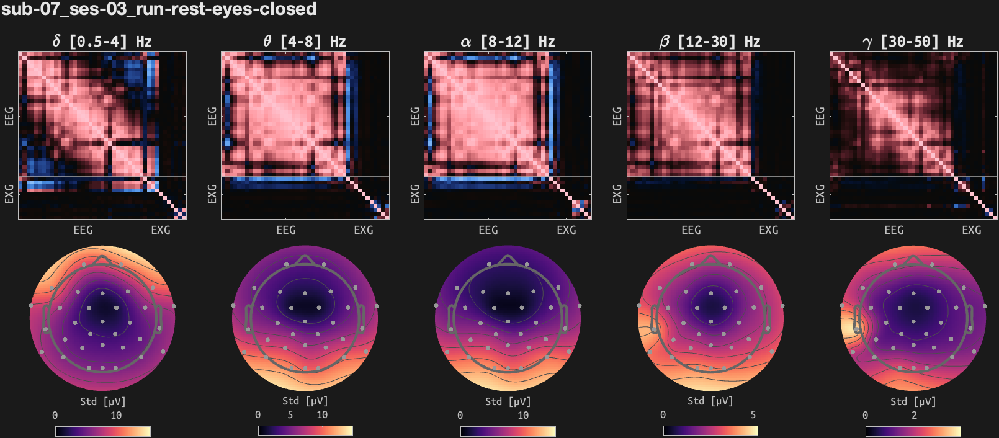

# sub-09_ses-03
## sub-09_ses-03_run-rest-eyes-open
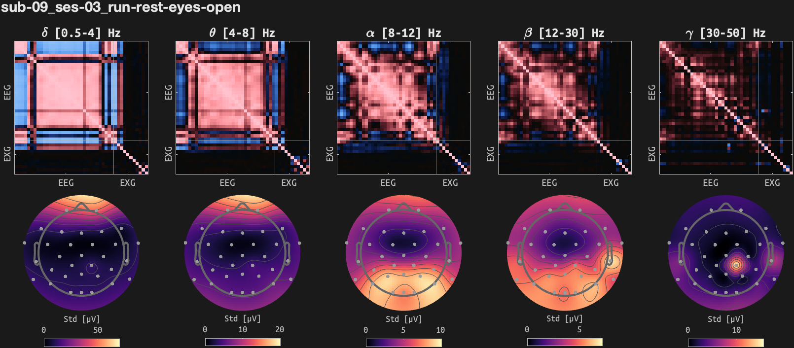

## sub-09_ses-03_run-rest-eyes-closed
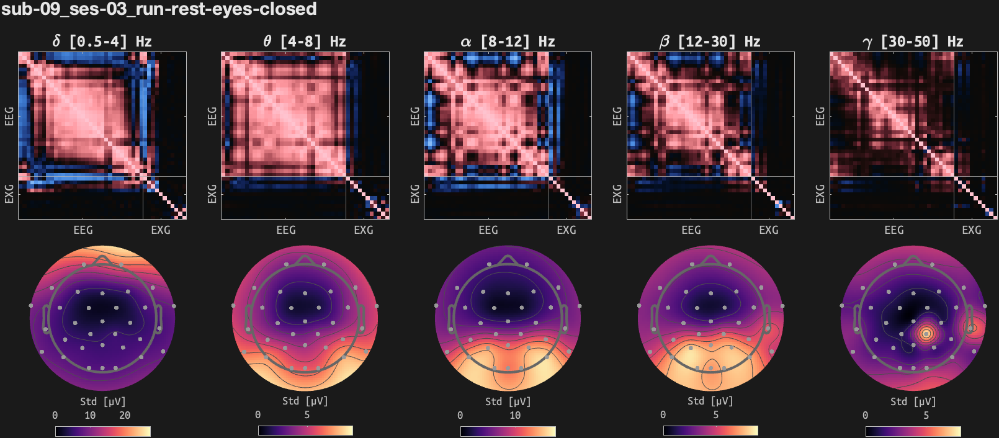

# sub-10_ses-03
## sub-10_ses-03_run-rest-eyes-open
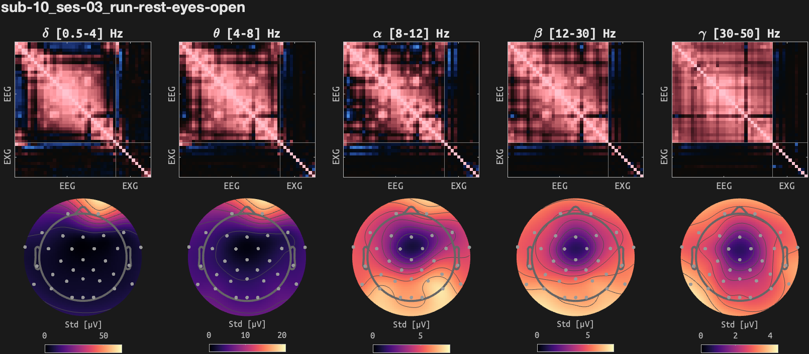

## sub-10_ses-03_run-rest-eyes-closed
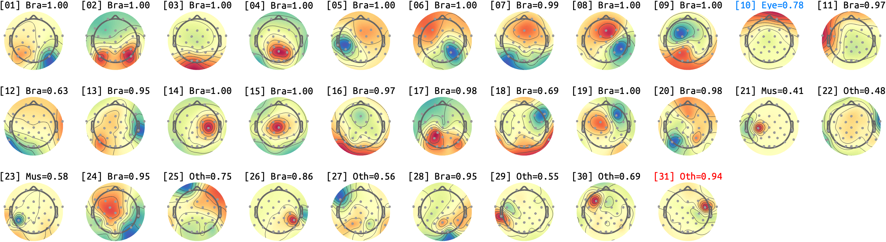

<small>Max IC-Label classificiation probability (except for HEART) for each IC. *Bra*: Brain, *Mus*: Muscle, *Lin*: Line, *Cha*: Channel, *Oth*: Other. *RED*: P>.90, *BLUE*: Manual-BAD, *GREEN*: Manual-GOOD</small>
