# sub-01_ses-14
## sub-01_ses-14_run-rest-eyes-open
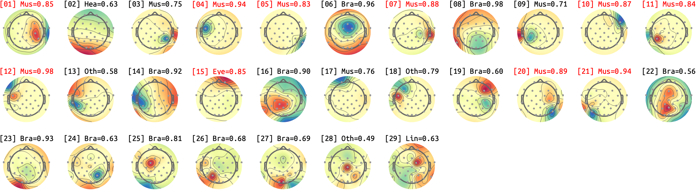

## sub-01_ses-14_run-rest-eyes-closed
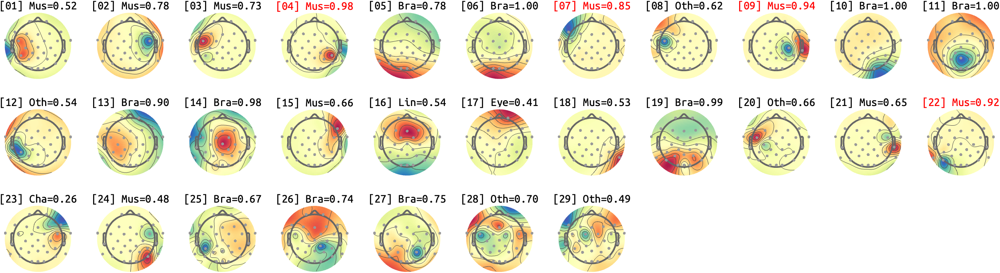

# sub-02_ses-14
## sub-02_ses-14_run-rest-eyes-open
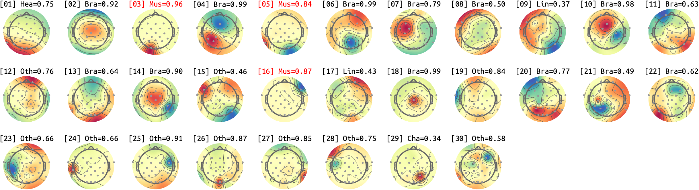

## sub-02_ses-14_run-rest-eyes-closed
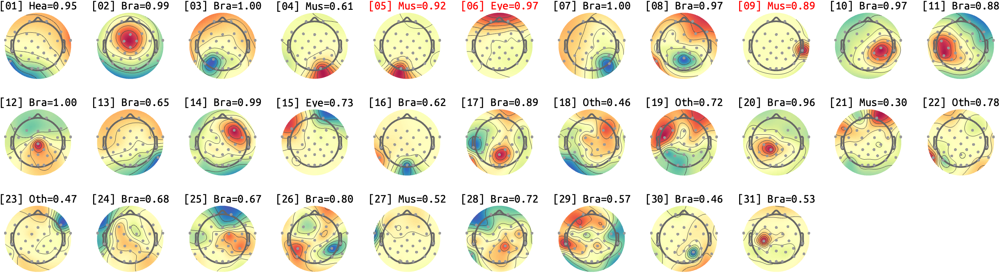

# sub-03_ses-14
## sub-03_ses-14_run-rest-eyes-open
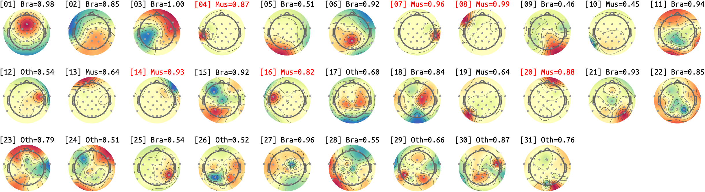

## sub-03_ses-14_run-rest-eyes-closed
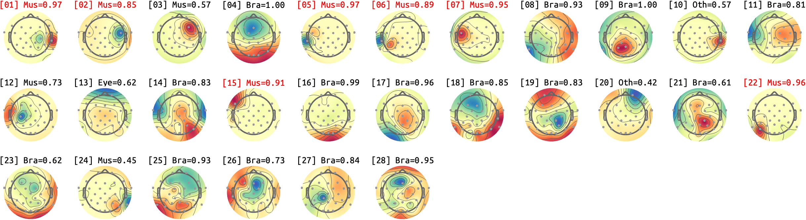

# sub-07_ses-14
## sub-07_ses-14_run-rest-eyes-open
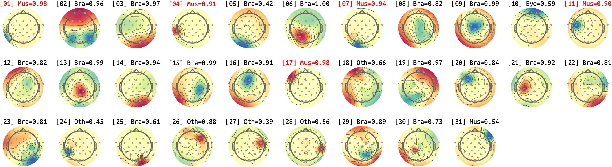

## sub-07_ses-14_run-rest-eyes-closed
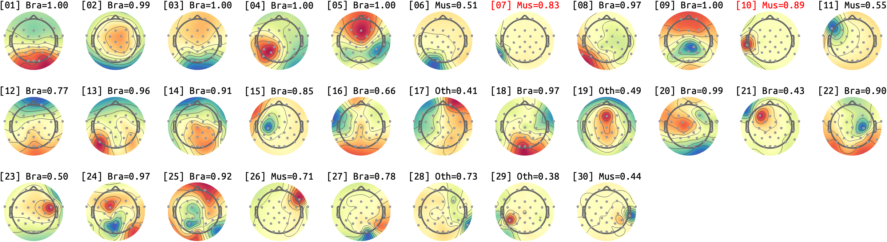

# sub-09_ses-14
## sub-09_ses-14_run-rest-eyes-open
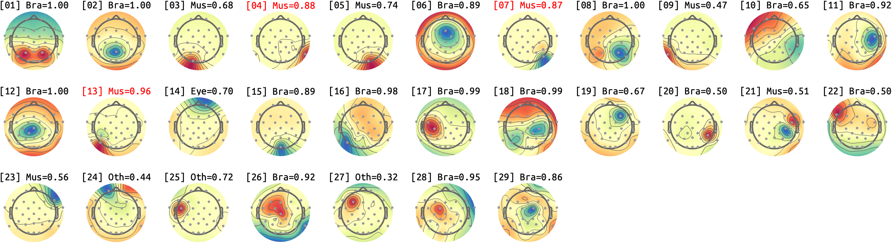

## sub-09_ses-14_run-rest-eyes-closed
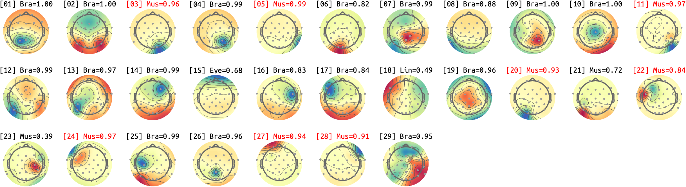

# sub-10_ses-14
## sub-10_ses-14_run-rest-eyes-open
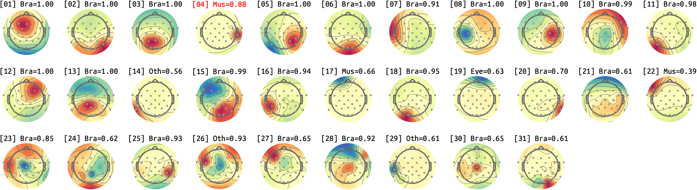

## sub-10_ses-14_run-rest-eyes-closed
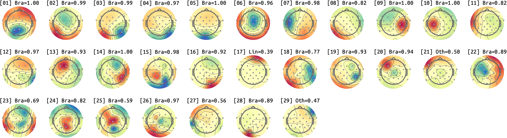

