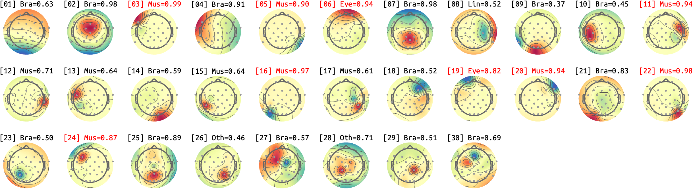
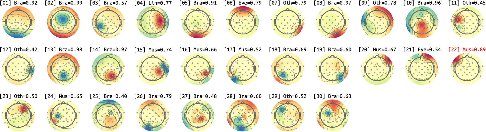
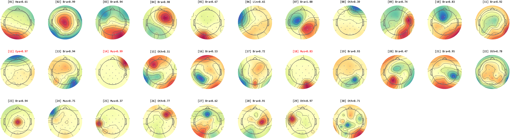
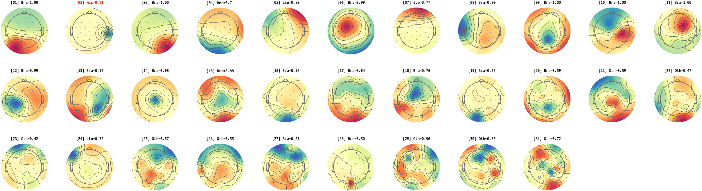
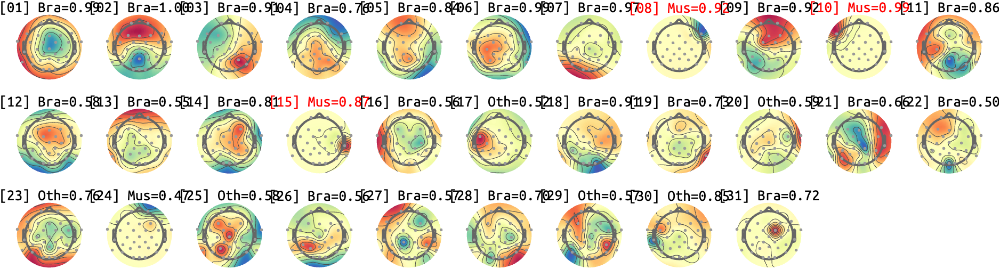
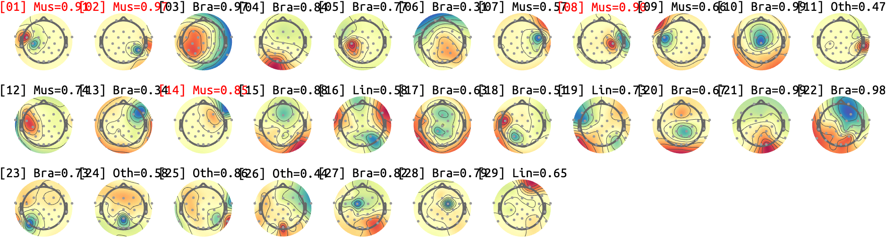
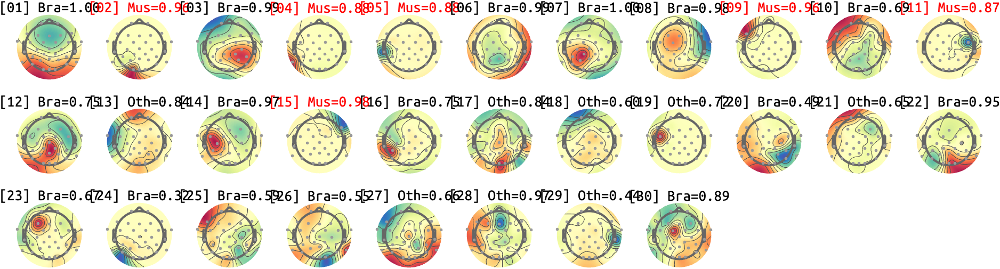
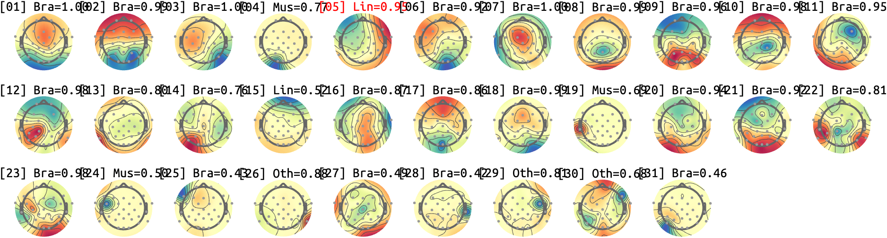
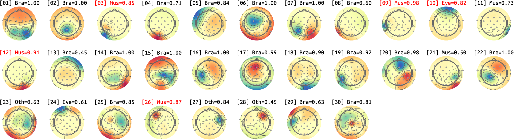
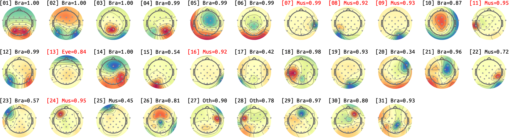

# sub-01_ses-17
## sub-01_ses-17_run-rest-eyes-open

## sub-01_ses-17_run-rest-eyes-closed

# sub-02_ses-17
## sub-02_ses-17_run-rest-eyes-open

## sub-02_ses-17_run-rest-eyes-closed

# sub-03_ses-17
## sub-03_ses-17_run-rest-eyes-open

## sub-03_ses-17_run-rest-eyes-closed

# sub-07_ses-17
## sub-07_ses-17_run-rest-eyes-open

## sub-07_ses-17_run-rest-eyes-closed

# sub-09_ses-17
## sub-09_ses-17_run-rest-eyes-open

## sub-09_ses-17_run-rest-eyes-closed

# sub-10_ses-17
<small>Max IC-Label classificiation probability (except for HEART) for each IC. *Bra*: Brain, *Mus*: Muscle, *Lin*: Line, *Cha*: Channel, *Oth*: Other. *RED*: P>.90, *BLUE*: Manual-BAD, *GREEN*: Manual-GOOD</small>
