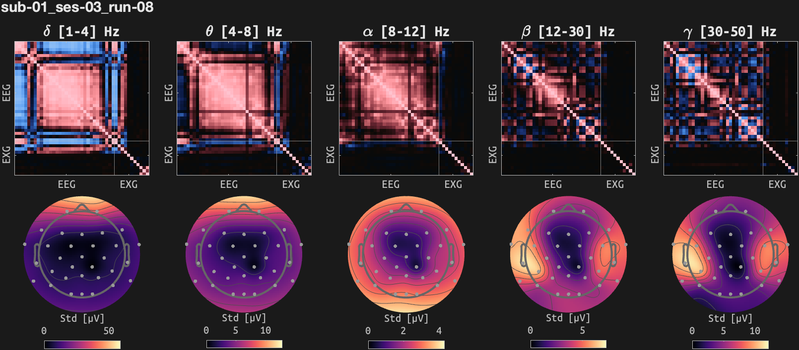
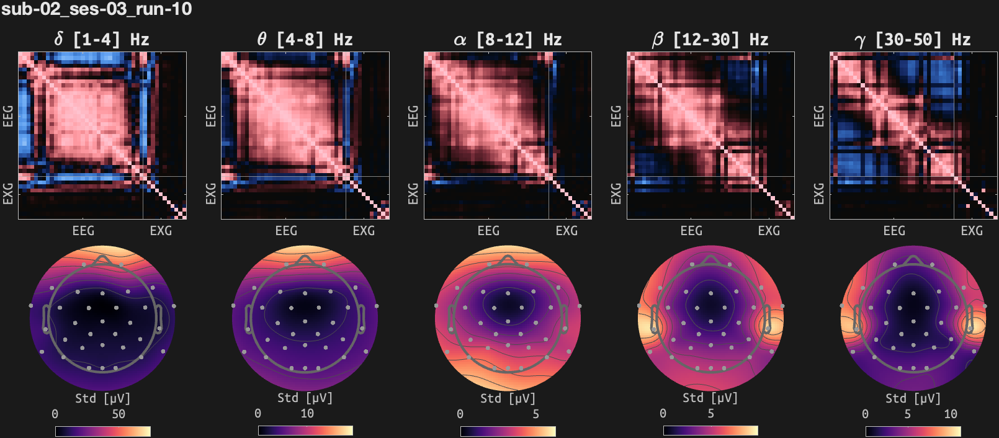
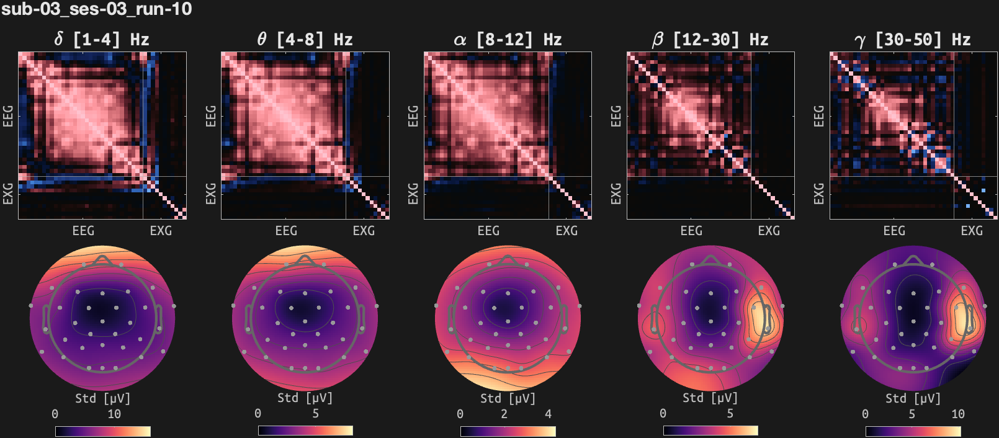
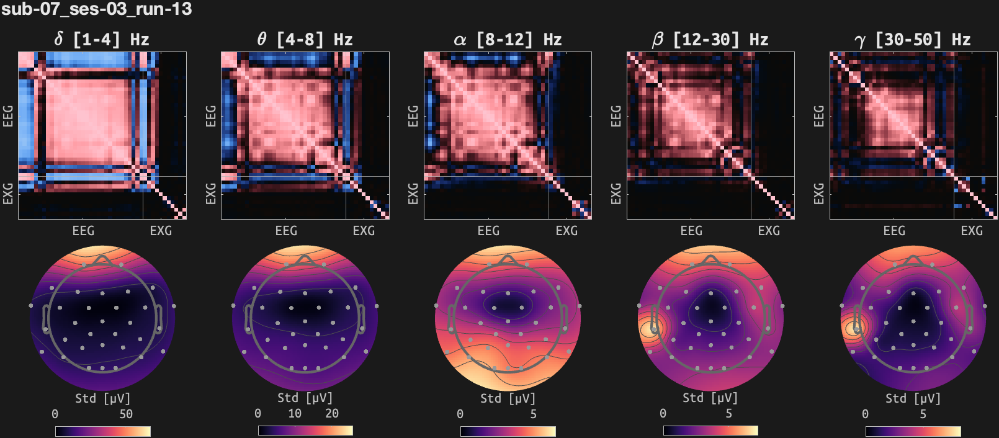
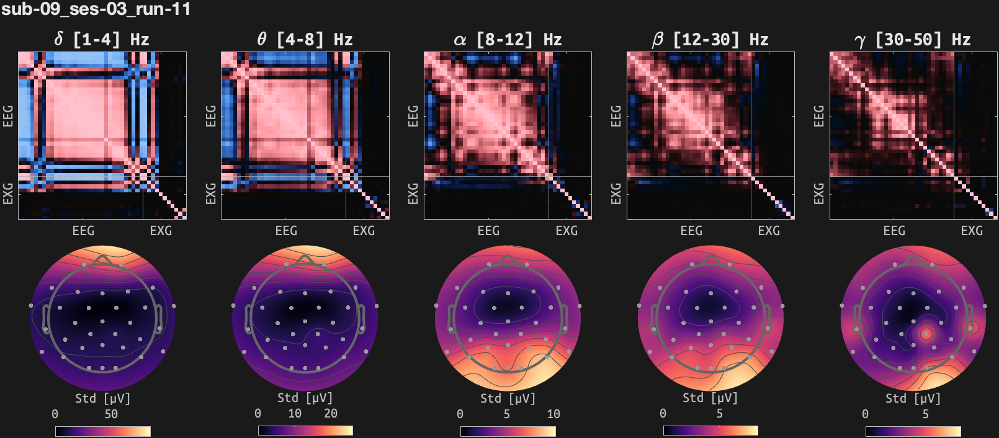
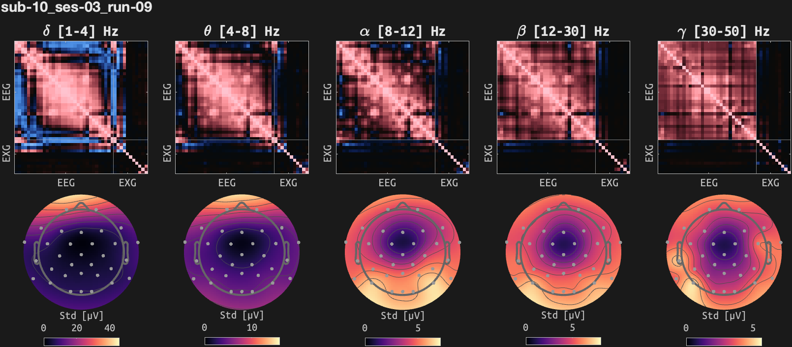

## sub-01_ses-03
### 3-min resting while listening to pinknoise with eyes open

### 3-min resting while listening to pinknoise with eyes closed

### 6-min emotion rating (a horizontal slider) while listening to Bohemian Rhapsody

## sub-02_ses-03
### 3-min resting while listening to pinknoise with eyes open

### 3-min resting while listening to pinknoise with eyes closed

### 6-min emotion rating (a horizontal slider) while listening to Bohemian Rhapsody

## sub-03_ses-03
### 3-min resting while listening to pinknoise with eyes open

### 3-min resting while listening to pinknoise with eyes closed

### 6-min emotion rating (a horizontal slider) while listening to Bohemian Rhapsody

## sub-07_ses-03
### 3-min resting while listening to pinknoise with eyes open

### 3-min resting while listening to pinknoise with eyes closed

### 6-min emotion rating (a horizontal slider) while listening to Bohemian Rhapsody

## sub-09_ses-03
### 3-min resting while listening to pinknoise with eyes open

### 3-min resting while listening to pinknoise with eyes closed

### 6-min emotion rating (a horizontal slider) while listening to Bohemian Rhapsody

## sub-10_ses-03
### 3-min resting while listening to pinknoise with eyes open

### 3-min resting while listening to pinknoise with eyes closed

### 6-min emotion rating (a horizontal slider) while listening to Bohemian Rhapsody

