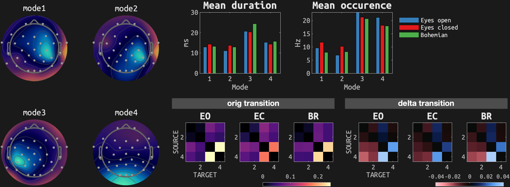
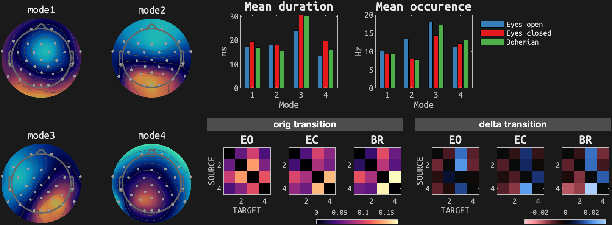
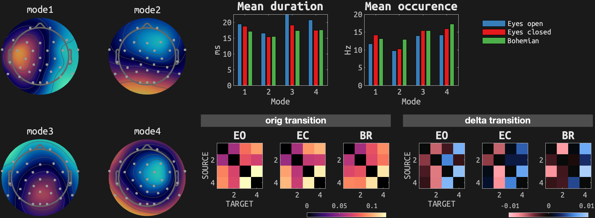
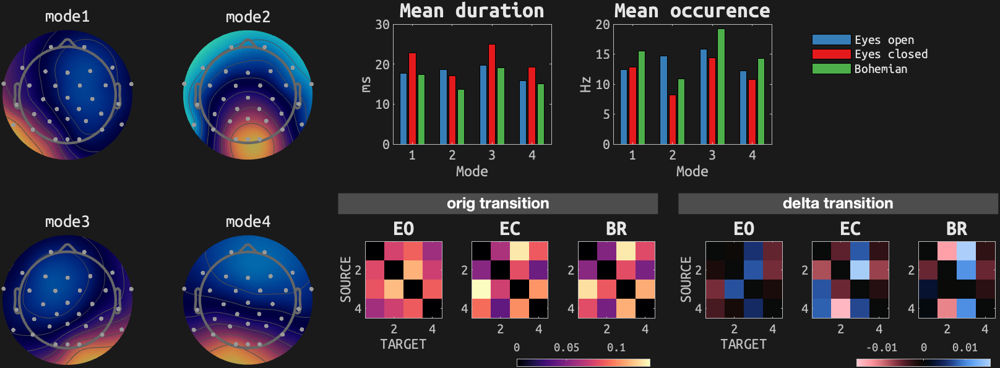
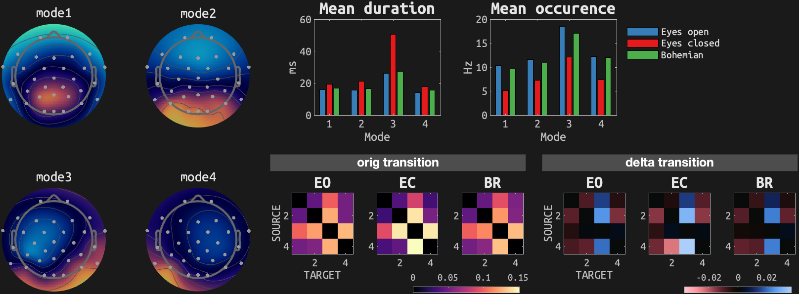
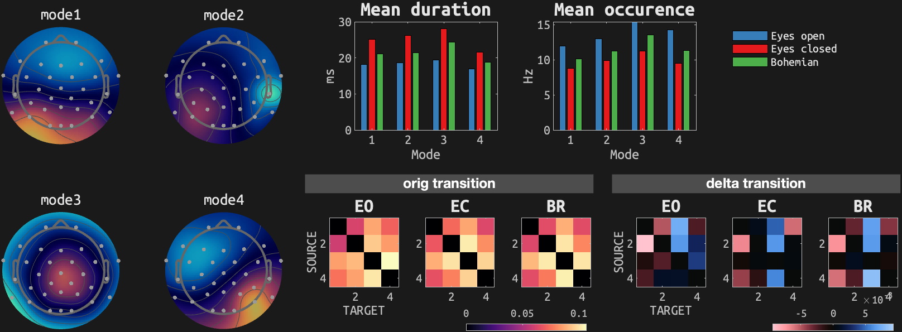

# Microstates (k=4)
## sub-01_ses03

## sub-01_ses07

## sub-02_ses03

## sub-02_ses07

## sub-03_ses03

## sub-03_ses07

## sub-07_ses03

## sub-07_ses07

## sub-09_ses03

## sub-09_ses07

## sub-10_ses03

## sub-10_ses07

