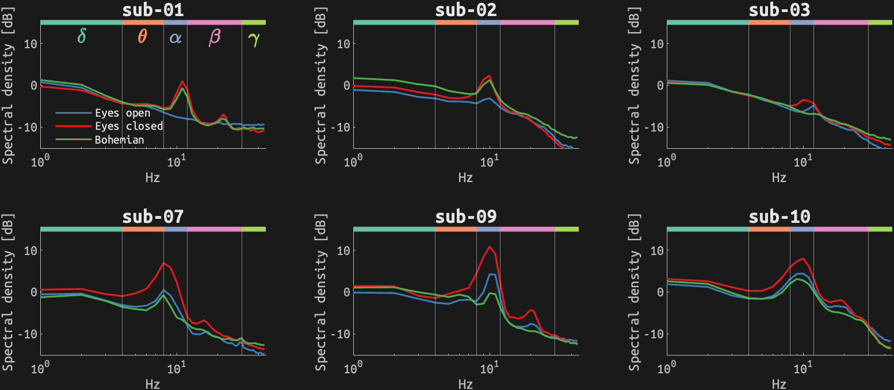

# Spectral density
## Resting runs in session 03

## Resting runs in session 07

<small>Delta=[1, 4] Hz, Theta=[4, 8] Hz, Alpha=[8, 12] Hz, Beta=[12, 30] Hz, Gamma=[30, 45] Hz; Eyes open: 3-min resting while listening to pink noise with eyes open and fixating on a cross; Eyes closed: 3-min resting while listening to pink noise with eyes closed; Bohemian: 6-min rating of Liking/Disliking with a slider.</small>