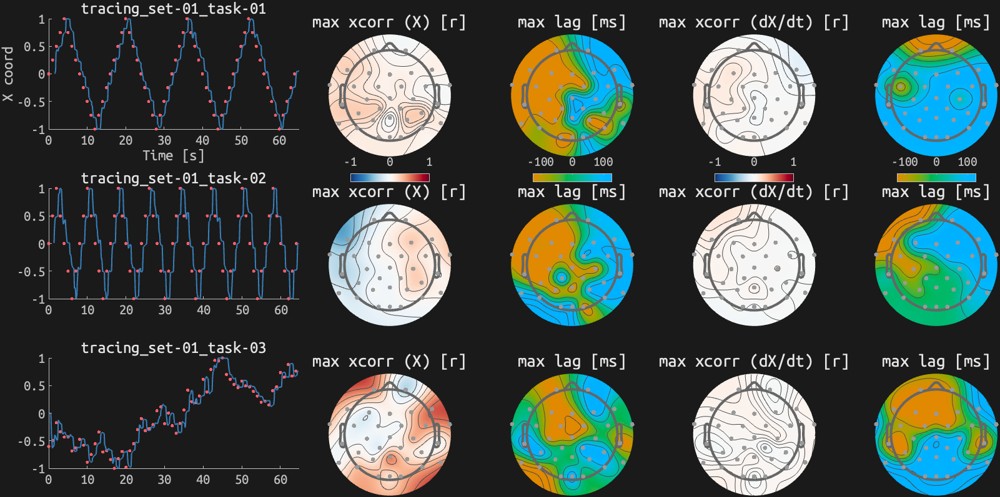
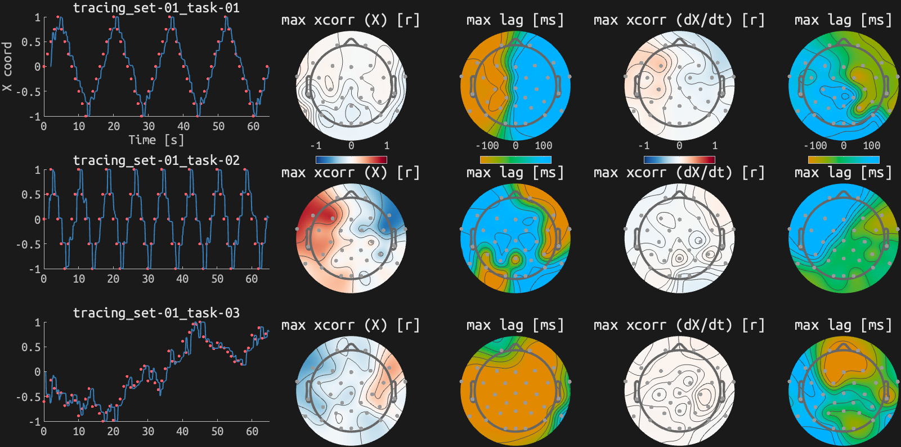
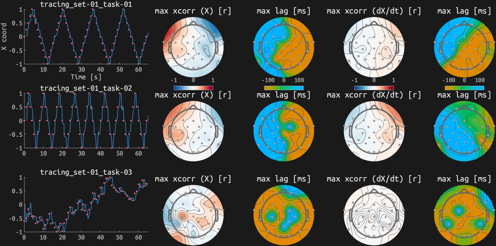
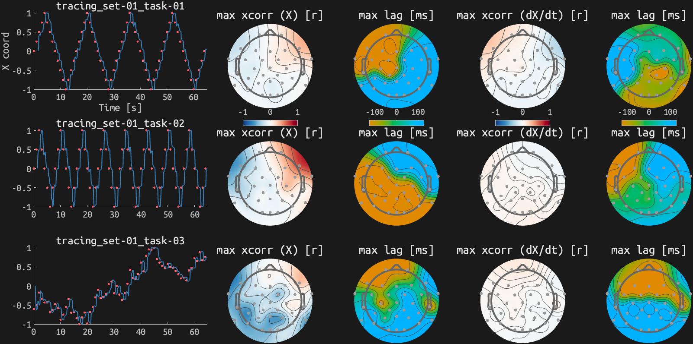
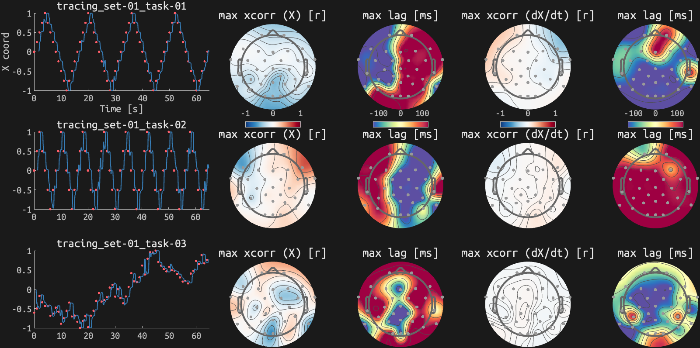

# Cross-correlation with trackball tracing
## sub-01_ses-09

<small>EEG time and PTB time have not been synchronsed here!</small>
## sub-02_ses-09

<small>EEG time and PTB time have not been synchronsed here!</small>
## sub-03_ses-09

<small>EEG time and PTB time have not been synchronsed here!</small>
## sub-07_ses-00

<small>EEG time and PTB time have not been synchronsed here!</small>
## sub-09_ses-09

<small>EEG time and PTB time have not been synchronsed here!</small>
## sub-10_ses-09

<small>EEG time and PTB time have not been synchronsed here!</small>
