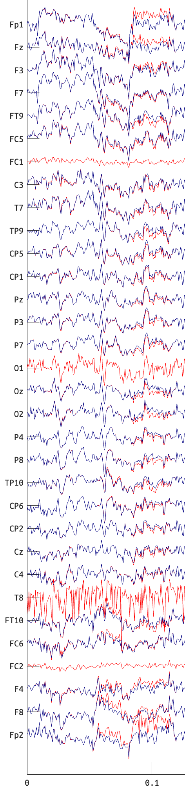
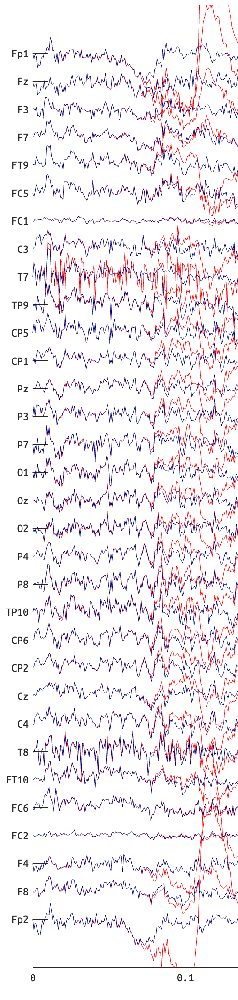

# Repair-on-the-fly🛠️✈️

I would like to start with the Ship of Theseus paradox🛳️⚖️: *if you replace every single part of a ship, is it still the same ship?* And I want to take it to the next level. *If you replace every single part of a ship during the sailing, is it still the same ship?* What about an airplane? *If you replace every single part of an airplane during the flight, is it still the same airplane?* 🤔

In this page, I will document the repairs made on-the-fly, during the data collection. All issues found are documented here, along with the fixes applied. This is to ensure transparency and traceability of the data collection process. And also I think all technical issues are scary👻 at first but hilarious😂 once you understand them. So, enjoy the read! 😄

## Why does the ARS flag FC1/2 as BAD in some participants, consistently across sessions? 😵
Updated: 2026-01-21

We observed that the ARS function in EEGLAB's CLEAN_ARTIFACTS() often flagged FC1 and FC2 channels as BAD in some participants, consistently across sessions (i.e., sub-07, sub-10; see [Channel-goodness-per-session]). Since the central electrodes (`*C`, `*Z`) are critical in observing auditory cortical responses, we investigated what caused such a classification by the ASR.

What are the common causes?

### ~~Are the electrodes broken?⛓️‍💥~~
Perhaps the electrodes FC1 and FC2 were faulty?
> We mostly have been using the ELEC-17 for these participants, but we see BAD channels when using other channels, and the same electrode bundle (ELEC-17) works fine for other participants. So, it is unlikely that the electrodes are faulty.

### ~~Are we gelling the electrodes right?💦~~
**Too much?** Are we using too much gel on these electrodes, causing them to be bridged together?
> [Alschuler+2014] proposed a method to identify bridged electrodes by looking at the correlation between channels. However, in our case, we do not see high correlations between FC1 and FC2 or with other channels. So, it is unlikely that the electrodes are bridged. 🤷

**Too little?** Are we using too little gel on these electrodes, causing high impedance and noisy signals?
> Not really, because we make sure all impedances are below 25 kOhm before starting the recording. Mid-run checking of impedances also shows that these electrodes are within acceptable ranges.

### Because of the head shapes?💀

Could it be that their head shapes cause poor contact of those electrodes? Does the cap fit them poorly around those electrodes?
> I tightened the cap so that those channels can have better contact (sub-07_ses-05). This actually made the ASR not flag FC1/2 as BAD anymore, but not all runs. Also, it led to discomfort for the participant, and we had to loosen it from the 4-th run. So, this is not an ideal solution. But it is noteworthy that the cap fit can affect the channel signal quality.


### To cut this wild goose chase short🪿
By the way, what does it mean that the ASR detects FC1/2 as BAD? Let's look at the raw data.


  

<small>Red=raw, Blue=cleaned</small>

- From these segments, the amplitudes of FC1 and FC2 are low in both subjects. This may simply reflect their proximity to the reference (i.e., FCz), rather than any abnormality like bridging or poor contact. 
- At least in these segments, FC1/2 look more or less similar in both subjects. Then, why was it flagged as BAD in one subject but not the other? 
- After high-pass filtering (e.g,. >0.5 Hz), `EEGLAB/clean_artifacts()` calls another function `EEGLAB/clean_channels()`, which computes n-1 correlations between one channel and the average of all other channels for each segment (e.g., 50 samples). If a channel has a lower correlation than a threshold (default: 0.85), it is marked as BAD for that segment. If the fraction of BAD segments over the whole data exceeds another threshold (default: 0.5), the channel is marked as BAD overall. This is to discard flatlined channels based on the assumption that all normal EEG channels are strongly correlated to each other.
- Another criterion that `EEGLAB/clean_channels()` uses is the relative strength of the line noise power, which was simply estimated from a fixed bandwidth (>50 Hz).
- In our case, the BAD channels (FC1/2) did not show low correlations with other channles (i.e., not flatline), but they had abnormally high line noise (> 5 SDs).
- This is surprising because the line noise should have been removed in the first preprocessing step using `EEGLAB/pop_cleanline()`. However, it seems that in some participants, the line noise was not fully removed, possibly due to their head shapes and the cap fitting. This residual line noise then caused FC1/2 to be flagged as BAD by ASR.

> To mitigate this issue, I adjusted the line noise threshold in `EEGLAB/clean_channels()` from the default 4 SDs to 8 SDs, as line noise contamination can be addressed later during ICA denoising.


## Why the batteris of the StimTrak ran out so quickly?🪫
Updated: 2026-01-21

It seems that the battery chargers at the EEGLAB1 lab were not fully functional, causing the StimTrak batteries to be not fully charged before use. One must put only one battery in a single deck charger slot, not two batteries in one slot. Putting two batteries in one slot can cause incomplete charging of both batteries. Use the additional charger (one with the blue LED display) to charge more than 4 batteries at once.

> This issue was discovered when the StimTrak batteries ran out quickly during data collection in 3 runs. Because it doesn't affect the data quality, the data collection continued after replacing the batteries with fully charged ones.


## Memory leakage of a third-party program used for Windows volume control💾🩸
Updated: 2026-01-15

During the data collection sessions on Windows, I called a third-party program called "nircmd" to control the Windows system audio volume, at the beginning of each run. However, I noticed that over time, it somehow led to audio playback performance issues (i.e., interupted audio) after several runs. After investigating, I found that each time I called "nircmd", it created a new process in the background, and those processes accumulated over time, leading to memory leakage.

> This issue impacted 2 runs of one session, which were re-done. I changed the script to call "nircmd" only once at the beginning of the session, instead of at the beginning of each run.


## Why did some tracks abruptly stop during replay?🎤🙀
Updated: 2026-01-07

In fact, some of the MTG-Jamendo tracks were cropped incorrectly at the source (i.e., Jamendo). Those tracks are not available online anymore, but the faulty versions were included in the MTG-Jamendo dataset we used.

But in other cases, I was playing tracks at a wrong sampling rate. Some tracks were at 44.1 kHz, others at 48 kHz. As a one who writes robust code🧐, I wrote my script to resample the audio tracks to 44.1 kHz before playback.

However, I made a mistake when resampling the tracks. In my memory, the syntax was like this:
```matlab
x_new = resample(x_old, fs_old, fs_new);  % oops
```

But in fact, the correct syntax is:
```matlab
x_new = resample(x_old, fs_new, fs_old);  % correct
```
Because what it actually does is to resample the signal at the p/q times the original sampling rate in 
```matlab
x_new = resample(x_old, p, q)
```
So, `p/q*fs_old = fs_new/fs_old*fs_old = fs_new`.

Thus, it could have been playing a bit slower than the original, but because of the bug, it was actually played even more slowly because it was then resampled at 48/44.1*48 = 52.24 kHz. 🙃

> This bug caused 3 tracks to be played incorrectly, and those tracks were redone in later sessions.

---

[Channel-goodness-per-session]: https://manymusic.net/rec/#channel-goodness-per-session
[Alschuler+2014]: https://doi.org/10.1016/j.clinph.2013.08.024